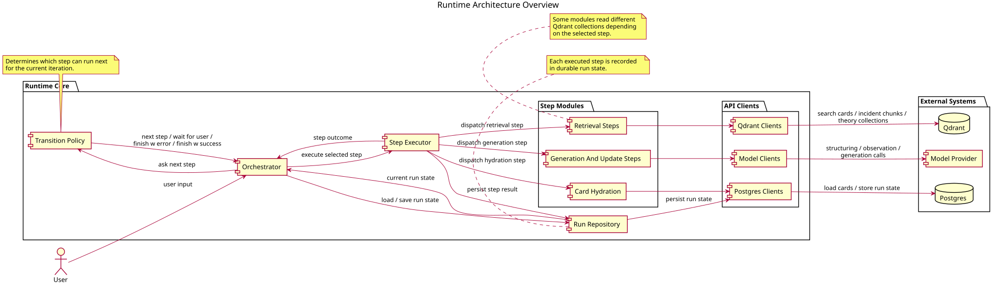
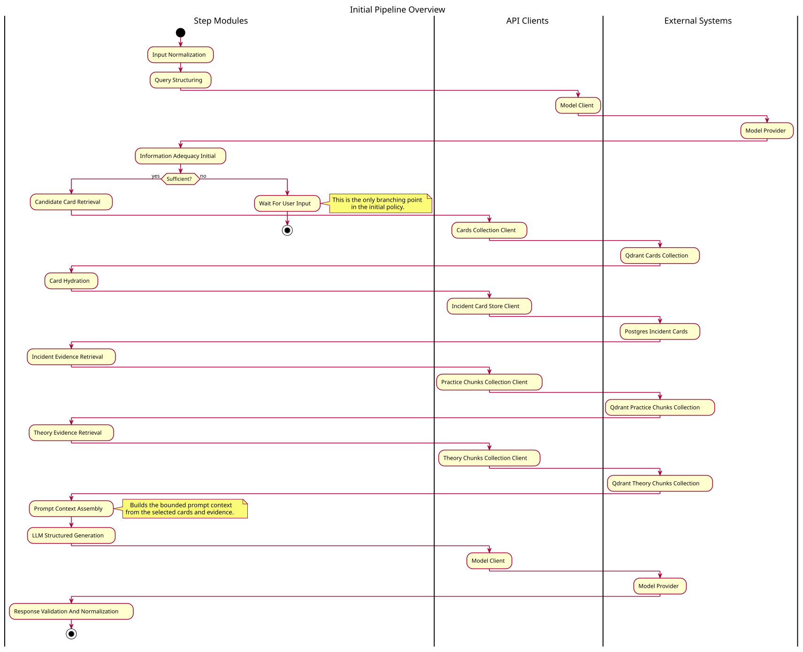

# Runtime Architecture

This project is a precedent-guided diagnostic assistant for distributed systems incidents. Its runtime is built to do something narrower and more structured than generic question answering: it takes a user-reported problem, retrieves practical and theoretical context around that problem, turns the retrieved material into a compact diagnostic prompt, and returns a bounded diagnostic state rather than an unconstrained answer.

At a high level, the system has five major parts:

- an entrypoint that accepts the user request and returns a validated diagnostic response;
- an orchestrator that drives the runtime step by step and persists execution state;
- a request pipeline made of explicit modules for normalization, retrieval, prompt building, generation, and response validation;
- storage and retrieval layers for incident cards, chunks, and run state;
- observability around the runtime flow and model calls.

The rest of this document focuses on how those parts fit together.

## System Shape

The runtime separates control flow from request-processing work.

The orchestrator owns the lifecycle of a diagnostic run: starting a run, resuming a run, appending a new iteration when the user provides more information, and deciding which executable step should happen next. The request pipeline owns the leaf processing stages such as query structuring, evidence retrieval, prompt context assembly, model invocation, and final response normalization.

The runtime models that lifecycle explicitly as `run -> iteration -> step`. A run is one diagnostic session. Each iteration is one bounded pass through the pipeline for either the initial user report or a later follow-up input. Each step is one executable unit inside that pass. This structure exists so the system can pause when it needs more user input, resume later without losing history, and keep continuation work attached to the same evolving case rather than treating every follow-up as a brand-new request.

This split matters because the assistant is not a single-pass call. It needs durable run history, explicit iteration boundaries, and a controlled way to continue diagnosis when the user adds a new observation later. The runtime therefore treats a diagnostic session as an evolving stateful process rather than as one isolated prompt.

For the product-level framing of the diagnostic state itself, see [OVERVIEW.md](/home/olesia/code/dist_sys_assistant/Documentation/OVERVIEW.md) and [DIAGNOSTIC_MODEL.md](/home/olesia/code/dist_sys_assistant/Documentation/DIAGNOSTIC_MODEL.md).

## Main Components

### Orchestrator

The orchestrator is the runtime kernel. It owns the public run-driving entrypoints, durable run progress, and the loop that moves a run from one step to the next. It does not embed retrieval or prompting logic directly. Instead, it asks a transition policy what should happen next and delegates actual step execution to the step executor.

### Request Pipeline

The request pipeline is a set of explicit runtime stages. Each stage has one narrow responsibility and produces a typed output for the next stage. In the first-response flow, those stages cover input normalization, query structuring, card retrieval, card hydration, incident and theory evidence retrieval, prompt context assembly, structured generation, and response validation.

Continuation uses the same overall architecture but inserts observation-specific stages so the system can treat the new user input as an update to the current case rather than as a fresh unrelated request.

### Storage And Retrieval

The runtime depends on two different data layers.

Postgres stores canonical structured records such as incident cards and persisted run state. Qdrant stores retrieval-oriented representations used to search for relevant cards and chunks. This separation keeps canonical records and retrieval indexes distinct: one layer is optimized for trustworthy structured data, the other for fast similarity search.

### Model Layer

The model layer is used in more than one place. It is called to structure the initial user query, to resolve whether a continuation input can be treated as a usable diagnostic observation, to structure that resolved observation into atomic observations, and to generate the final structured diagnostic response from the packed prompt context.

That distribution matters because the runtime uses models both for controlled intermediate transformations and for the final user-facing response. The model is therefore not just the last step in the pipeline. At the same time, the architecture still keeps retrieval, prompt assembly, and response validation as separate stages around those calls, so model output is always produced inside a narrower typed module boundary rather than being allowed to define the whole runtime flow on its own.

### Observability

Observability is part of the runtime architecture because the system is multi-stage and retrieval-backed. When a response is weak, the team needs to tell whether the problem came from structuring, retrieval, context packing, generation, or validation. The architecture therefore assumes stage-level visibility rather than relying only on final outputs.

The current setup uses two trace backends with different roles. Tempo keeps the full operational trace of the runtime, including orchestration and request execution flow. Phoenix is used for the spans that belong to the AI-facing path: retrieval-related spans, prompt-preparation spans, and model-call spans. This split makes it easier to inspect the LLM and retrieval flow separately from the broader operational layer while still keeping both views inside the same overall observability model.

## Request Lifecycle

The first-response path is the default path for a new problem report.

1. The runtime receives a raw user request.
2. The request is normalized into a deterministic form suitable for downstream processing.
3. The normalized request is converted into a structured query representation.
4. Candidate incident cards are retrieved and partitioned into a primary branch and alternatives.
5. The selected card identifiers are hydrated into full structured card records.
6. Incident evidence and theory evidence are retrieved as separate context layers.
7. A prompt context is assembled from the normalized request, the selected card material, and the retrieved evidence.
8. The model produces a strict JSON response.
9. The response is validated and normalized into the trusted runtime output.

The continuation path starts when the user adds a new observation after an earlier answer.

Instead of restarting from scratch, the runtime appends a new iteration to the existing run. The new user input first passes through observation-boundary handling so the system can decide whether it is a diagnostically usable update. It then extracts the observation in a structured way, carries forward the current diagnostic context, refreshes the supporting evidence for the updated situation, assembles a continuation prompt context, and produces a new validated response that updates the diagnostic state.

This is one of the most important architectural choices in the project: follow-up input is treated as part of an ongoing investigation, not merely as another chat turn.

For deeper details on prompt construction, see [PROMPT_CONTEXT_ASSEMBLY.md](/home/olesia/code/dist_sys_assistant/Documentation/PROMPT_CONTEXT_ASSEMBLY.md).

## Orchestration And Run State

The runtime models execution explicitly as `run -> iteration -> step`.

A run is the durable container for one diagnostic session. An iteration is one bounded pass of work inside that session, usually corresponding either to the first response or to one later user follow-up. A step is one executable unit inside the pipeline, such as query structuring or theory evidence retrieval.

In practice, `RunState` is the main persistent runtime object. It is not just a convenience wrapper around orchestration. It is the durable record of the session itself: the run header, the ordered iteration history, the ordered step-record history inside each iteration, the current run status, iteration statuses, and the serialized outputs or errors produced by each finished step. The storage model keeps that hierarchy explicit as `runs`, `run_iterations`, and `run_step_records`, with sequence numbers preserving canonical order and JSON payloads preserving step results without flattening them into step-specific tables.

That design matters because the system needs more than a final answer. It needs a recoverable execution history. A resumed run has to know which iteration is current, which step results already exist, whether the last iteration ended in success, error, or wait-for-user, and what user-facing state should be carried into the next iteration. `RunState` is therefore both operational memory and the canonical persistence boundary for orchestration.

This model gives the system three useful properties.

First, it makes pause-and-resume behavior explicit. The assistant can stop when it needs more user input and continue later without losing the history of how the current diagnostic state was reached.

Second, it keeps execution policy separate from execution mechanics. The transition policy decides which step should run next, while the step executor runs the corresponding pipeline module and returns a typed result.

Third, it gives the system a durable execution trace that is useful both for debugging and for evaluation. Run history is not just an implementation detail; it is a first-class part of how the runtime stays inspectable.

## Data Boundaries

The architecture relies on a small number of important data boundaries.

### Persistent Layer

Practical incident knowledge starts from source incident reports, typically PDF documents. Those reports are not used directly at request time. Instead, they are parsed into structured `IncidentCard` objects. An incident card is the canonical representation of one practical failure case: the full parsed structure with provenance, symptom fields, phase information, candidate explanations, discriminating checks, expected observations, and remediation-oriented fields.

These canonical cards are stored in Postgres and are treated as the source of truth. PostgreSQL stores the full structured card, not just a flattened search representation. The runtime uses this store when it needs the complete precedent behind a retrieved match.

Alongside the canonical card, the system also maintains a retrieval-oriented representation derived from that card. In the current architecture, one card produces one compact retrieval document built from a selected subset of card fields such as the title, short summary, canonical symptoms, affected components, failure-mode candidates, diagnostic patterns, root-cause summary, violated properties, claimed guarantees, and mitigations. That retrieval representation is stored in Qdrant and preserves the card identity through the same `case_id`. It is not a second source of truth; it exists only to support semantic search over incident precedents.

The runtime path through those layers is deliberately staged. It first searches Qdrant over the collection of card-derived retrieval documents to find the most relevant incident candidates. That step returns candidate `case_id` values rather than full cards. The runtime then uses those ids to hydrate the full canonical cards from Postgres. After that, it uses the same card identities to search a separate Qdrant collection of practice chunks linked to those cases, so that report-level evidence can be retrieved in the context of the selected card branches.

This distinction matters because card retrieval and evidence retrieval solve different problems. The card-level retrieval layer is used to find the most relevant incident precedents at the case level. The practice-chunk layer is then used to recover supporting evidence from the underlying report material associated with those selected cases.

Theory evidence is retrieved independently from the practical incident branch. This keeps mechanism-level explanation separate from precedent-level matching. Both are useful, but they play different roles in the final diagnostic response.

### Run State

Run state is a separate persistent boundary from the evidence layer. Incident cards, card-derived retrieval documents, and report chunks belong to the diagnostic corpus. `RunState` belongs to the runtime itself. It stores the ordered execution history over that corpus: runs, iterations, step records, and the typed payloads produced by those steps.

At request time, the runtime creates several transient artifacts on top of those stored layers: the normalized request, the structured query, the current card selection context, the packed prompt context, and the final validated response. These artifacts are central to runtime behavior even though they are not all stored as canonical long-lived records.

## Architectural Principles

Several design ideas hold the runtime together.

The first is separation between retrieval, reasoning setup, and generation. The model is called only after the system has already selected, structured, and compressed the context that should shape the answer.

The second is role separation between primary precedent, alternative context, and theory. They are all evidence, but they exert different kinds of pressure on the diagnostic response. The architecture preserves that distinction rather than flattening everything into one undifferentiated retrieval list.

The third is bounded context assembly. The runtime does not pass every retrieved artifact into the model. It packs a small context chosen for match grounding, competing pressure, mechanism explanation, and next-check usefulness.

The fourth is stateful continuation. A later observation updates an existing diagnostic case instead of erasing it and starting over from an empty context.

The fifth is durable orchestration. Execution state is explicit and persisted, which makes the runtime easier to resume, inspect, and evaluate.

## Related Documents

This document is meant to work alongside a few narrower documents:

- [OVERVIEW.md](/home/olesia/code/dist_sys_assistant/Documentation/OVERVIEW.md) explains the product idea and the user-visible reasoning shape.
- [DIAGNOSTIC_MODEL.md](/home/olesia/code/dist_sys_assistant/Documentation/DIAGNOSTIC_MODEL.md) describes the structure of the diagnostic state itself.
- [PROMPT_CONTEXT_ASSEMBLY.md](/home/olesia/code/dist_sys_assistant/Documentation/PROMPT_CONTEXT_ASSEMBLY.md) explains what enters the model context and how the packed context is formed.

Together, these documents describe the system from complementary angles: product framing, diagnostic reasoning model, prompt-context construction, and overall runtime architecture.
